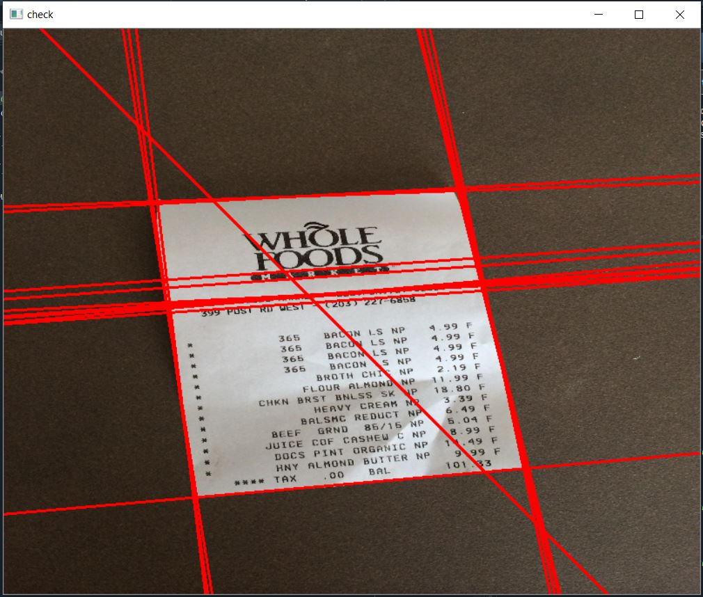
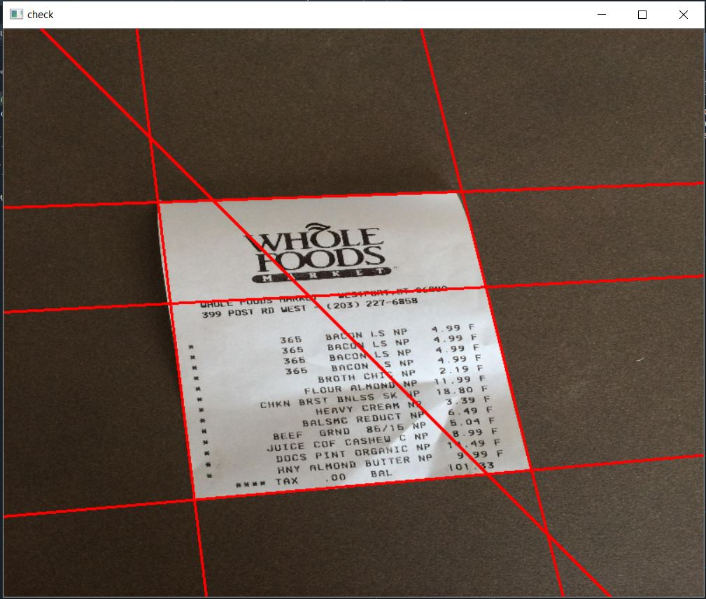
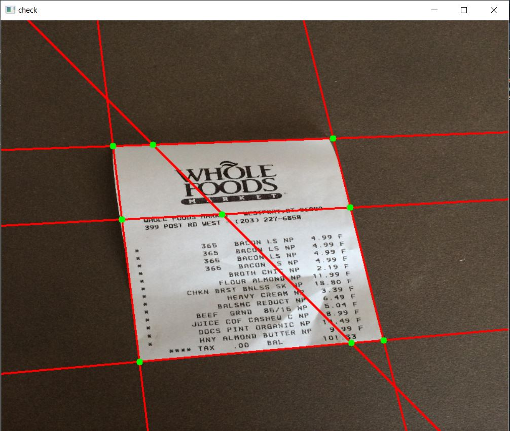
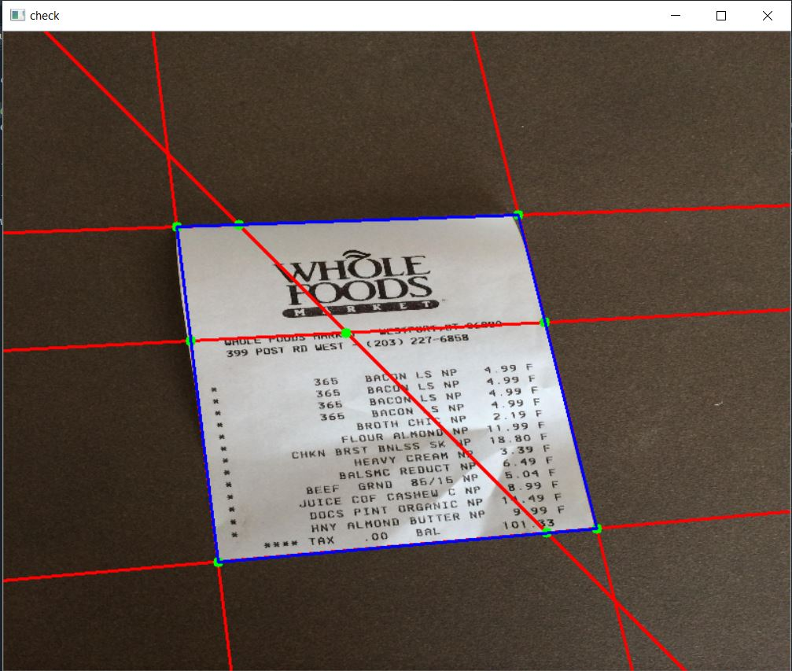

# Document-Scanner-using-OpenCV

Students like me are regular users of Document Scanners. Several doc-scanner apps like Adobe Scan and Camscanner are popular for clear and sharp image/PDF scan results, editing and sharing etc. Being fascinated by the application and having the knowledge of OpenCV, I chose to build one by myself.

This is an interractive document scanner.

- The user needs to provide the image.

- All possible edges in the image will be determined using cv2.HoughLines().

- Out of bunch of closely fitted lines, only unique lines are chosen.

- Then, all possible intersecting points will be chosen.

- Out of all possible quadrilaterals, the one with the largest area is chosen.

- The predicted quadrilateral is displayed, which the user can modify using drag-and-drop of corner points.

- In the entire procedure, to reset changes, press 'c', else press 'r' to proceed.

- Finally the original scan and B&W scan are produced and displayed.

- If the user is satisfied and wishes to store the results, go as per instructions provided and store the result(s) in the provided path.

